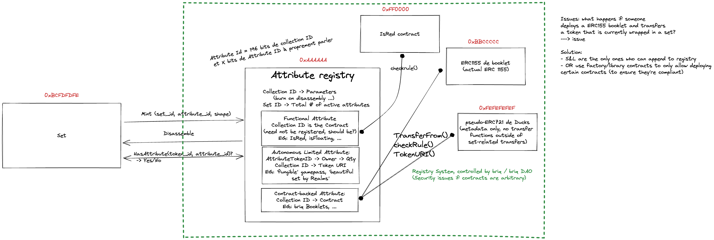

# Attributes

The briq ecosystem is intended to be flexible and extensible. This extensibility takes several form:
- At the briq level, custom `materials` can be created.
- At the set level, different on-chain `attributes` can be granted to sets.

Examples of possible attributes include:
 - Official Genesis Collection sets
 - 'red' sets
 - a shortlist of set by a custom curator (for e.g. beauty)
 - Sets that can be used in a gicen Metaverse.

Attributes can be granted to sets based on set properties, such as their 3D shape. They can also be dependent on external conditions, such as ownership of another NFT.

The `Attributes Registry` contract does the bookeeping of set attributes.

## Collections

Attributes are grouped under 'collection', to make it possible to have different qualities as part of a single, recognizable group.
An example of a collection is the `Genesis Collection` by briq, which groups all sets made from Genesis Booklets.

Collections can be managed by third-parties, and can have limited supply and arbitrary rules.

## Attribute ID

To make grouping in collections easier, the Attribute token ID contains the collection ID, defined as so:
`Attribute ID` = `actual attribute identifier` * 2^192 + `collection ID`

## Different kinds of attributes

Attributes come in 3 main categories:
- 'Functional' attributes are just functions of a set's data, and can be verified on-chain at any given moment. These could include attributes based on the set shape or the set color.
- 'Autonomous' attributes are handled directly by the `attributes registry`. Sets need to claim these attributes, and there can be a limited quantity of them available. Such attributes are managed by a third-party, the 'admin' of the collection.
- Contract-backed attributes are delegated to an external contract. The `booklet` contract, an ERC1155, is an example of such a contract in the native briq ecosystem. These contracts can be arbitrarily complex and extensible themselves.

For security reasons, contract-backed attributes must be whitelisted.
For practical reasons, creating collections is also permissioned at the moment.
Finally, functional attributes may only work on data present on-chain, and thus are currently limited.

### Abilities for collection

TODO: expand on this.
